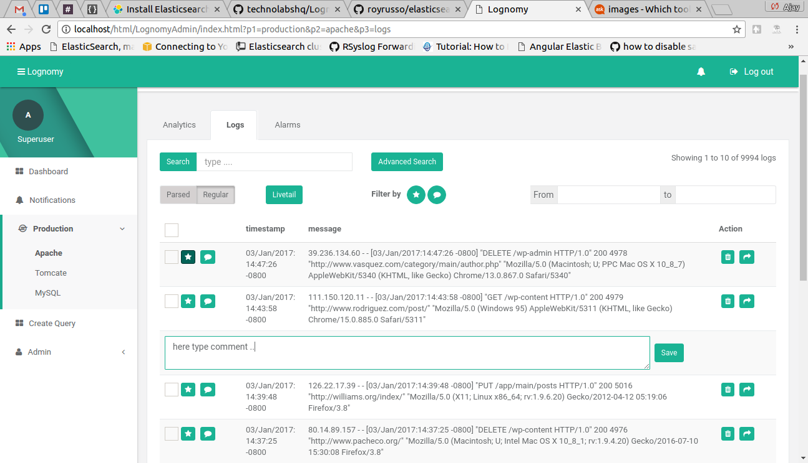

# Lognomy
LognomyAdmin supported Elasticsearch 5.x.x LognomyAdmin provide both authentication and authorization.

## Lognomy Features
+ Compatible with Elasticsearch 5.x.x and X-Pack
+ Admin Manage Users and Roles  
+ Querybuilder for Elasticsearch
+ Livetail Logs
+ Basic and advance filter or search
+ Like and Comment on Logs
+ Delete and share logs
+ Alarms Manage via Watcher

## Basic Usage
+ Install Elasticsearch.
+ Edit elasticsearch.yml for  Requesting cross-origin - "permissions" 
  <pre>
    <code> 
      http.cors.allow-origin: /http?:\/\/localhost(:[0-9]+)?/
      http.cors.enabled: true
      http.cors.allow-credentials: true
      http.cors.allow-headers: "X-Requested-With, Content-Type, Content-Length, Authorization"
    </code>
  </pre>
+ Install X-Pack plugin in elasticsearch
+ Install Logstash
  <pre>
     Start logstash with config file "./storage/logstash-apache.conf"
     <b>Example</b> : ~/logstash/bin/logstash -f ./storage/logstash-apache.conf
     <b>Note</b> : Update path value in logstash-apache.conf file. apache-logs.log file contain apache logs around 10000. 
     <code>
       input {
          file {
            path => "~/LognomyAdmin/storage/apache-logs.log"
          }
        }
     </code>
  </pre>
+ Now Open http://localhost/LognomyAdmin/index.html

 &nbsp; &nbsp;  
 
 &nbsp; &nbsp; &nbsp; &nbsp; 

&nbsp; &nbsp; &nbsp; &nbsp; 

&nbsp; &nbsp; &nbsp; &nbsp; 
